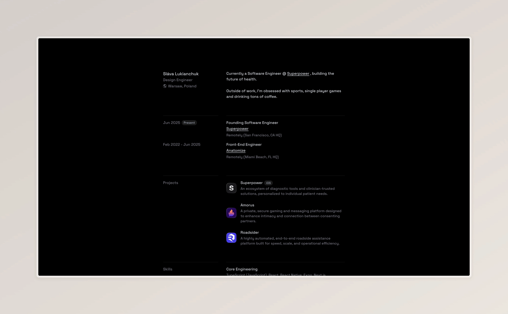

# Personal Website



> **Live Demo:** [slvlkn.cc](https://slvlkn.cc)

## About

Think of this repo as my little studio. I'm a design engineer who likes coding with style, so I use this site to mix "art" and logic, try weird ideas, and keep things feeling alive. I like the sweet spot where things look good and still feel fast.

## What's inside

- **Framework:** [Astro](https://astro.build) with React bits
- **Styling:** Tailwind CSS v4
- **Data Fetching:** SWR for the Spotify widget
- **Linting & Formatting:** ESLint + Prettier
- **Hosting:** Vercel
- **Package Manager:** Bun

> While React is my go-to, Astro’s rapid experimentation with new ideas and features made it impossible not to try — and it delivered.

## Run it locally

If you want to poke around:

```bash
# Clone the repository
git clone https://github.com/slavaluka/portfolio.git

# Install dependencies
bun install

# Start the dev server
bun dev
```

The site shows up at `http://localhost:4321`

## Build

```bash
# Build for production
bun build

# Preview production build locally
bun preview
```

## Project structure

```
├── public/              # Static assets (favicon, og-image, etc.)
├── src/
│   ├── assets/         # Images and project icons
│   ├── components/     # Astro & React components
│   │   └── ui/         # Reusable UI primitives
│   ├── layouts/        # Page layouts
│   ├── pages/          # Routes and API endpoints
│   ├── styles/         # Global CSS with Tailwind
│   └── types/          # TypeScript definitions
└── astro.config.mjs    # Astro configuration
```

## License

This project is open source and available under the [MIT License](LICENSE).

---

Built with 🤍 by [Sláva Lukianchuk](https://slvlkn.cc)
